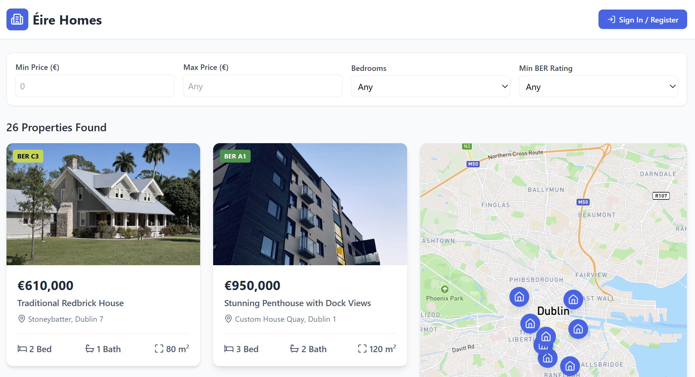
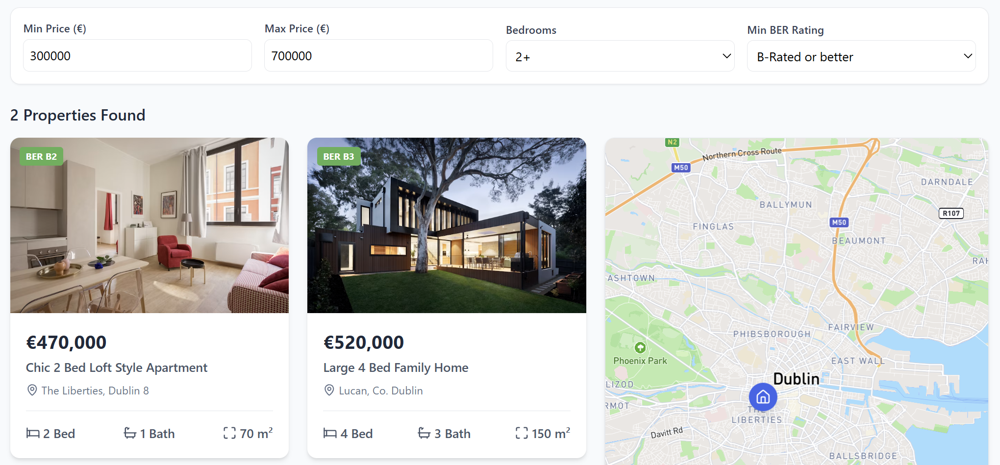
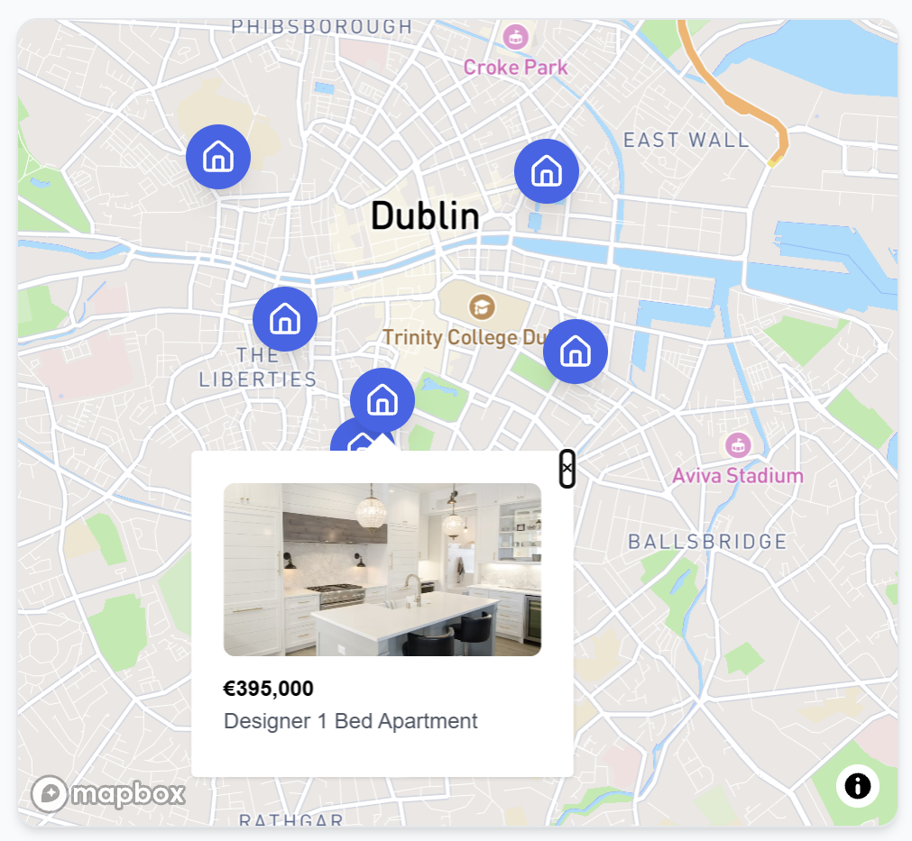
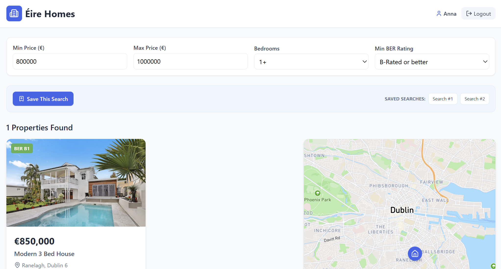
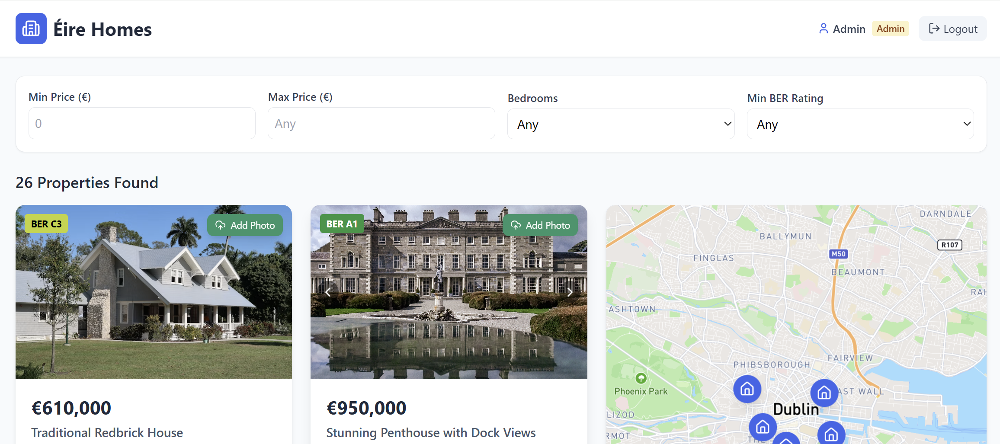

# 🏡 Éire Homes

> A modern, production-grade full-stack real estate web application built for the competitive Irish housing market (inspired by Daft.ie). Designed to showcase advanced system architecture, hybrid database management, secure role-based access control, and seamless UI/UX optimization.

---

## 📸 App Showcase & Functionality

### 1. Main Dashboard Overview
> General view of the application featuring the property catalog grid and interactive geospatial map.

### 2. Advanced Filtering System
> Server-side filtering by price range, minimum bedrooms, and BER energy ratings.

### 3. Interactive Geospatial Map (Mapbox)
> Real-time property visualization across Dublin with interactive map markers.

### 4. End-User Saved Searches (MongoDB)
> Authenticated standard user dashboard showing saved custom search queries stored in MongoDB.

### 5. Administrator Control Panel (RBAC & Media Upload)
> Admin view demonstrating role-based access control, photo management tools, and image carousels.

---

## 🚀 Key Features & Functionality

1. Server-Side Filtering & Pagination
- Optimized multi-parameter filtering system allowing users to query properties by price range, minimum bedrooms, and BER energy ratings directly on the backend via SQL queries (Prisma ORM).
- Server-side pagination for high-performance data loading and efficient memory utilization.

2. Interactive Mapbox Geospatial Integration
- Real-time interactive map integration visualizing property locations across Ireland, keeping spatial data synchronized with current filter states.

3. Secure RBAC Authentication & Authorization
- Robust JWT-based authentication system secured with Nest.js Guards (`JwtAuthGuard`).
- Strict Role-Based Access Control (RBAC): Differentiating between standard Users (who can save searches) and Administrators (who possess full privileges to manage properties and upload media).

4. Admin Media Management & Property Photo Updates
- Authorized administrators can instantly upload property photos directly from the interface.
- Files are safely handled on the backend via Multer middleware with strict file-type filtering and storage configuration.
- Features optimized local caching updates via TanStack Query to eliminate UI layout shifts and prevent unnecessary full-list refetches.

5. Hybrid Database Architecture (Polyglot Persistence)
- Relational PostgreSQL (via Prisma ORM): Manages core structured entities like Properties, Users, and Agencies with relational One-to-Many constraints.
- Non-Relational MongoDB (via Mongoose): Stores unstructured user activity logs and saved search preferences, demonstrating a hybrid database approach.

6. Client-Server State Optimization
- Leverages TanStack Query (React Query) for efficient server-state management, automated caching, and background refetching.
- Modern responsive layout styled completely with Tailwind CSS, following a mobile-first design philosophy.

---

## 🛠️ Tech Stack

### 🎨 Frontend:
- ⚛️ **React (v18)** with TypeScript
- 🗺️ **Mapbox GL** for interactive mapping
- ⚡ **TanStack Query (React Query)** for server-state caching
- 🎨 **Tailwind CSS** for responsive styling
- 📦 **Lucide React** for UI icons

### ⚙️ Backend & Architecture:
- 🟢 **Node.js** & **Nest.js** (Enterprise-grade modular architecture using Dependency Injection / IoC)
- 🗄️ **PostgreSQL** via **Prisma ORM** (Core relational data)
- 🍃 **MongoDB** via **Mongoose** (Activity logs & saved searches)
- 🛡️ **JWT Authentication** & custom Nest.js Guards
- 📂 **Multer** for secure file uploads and middleware management
